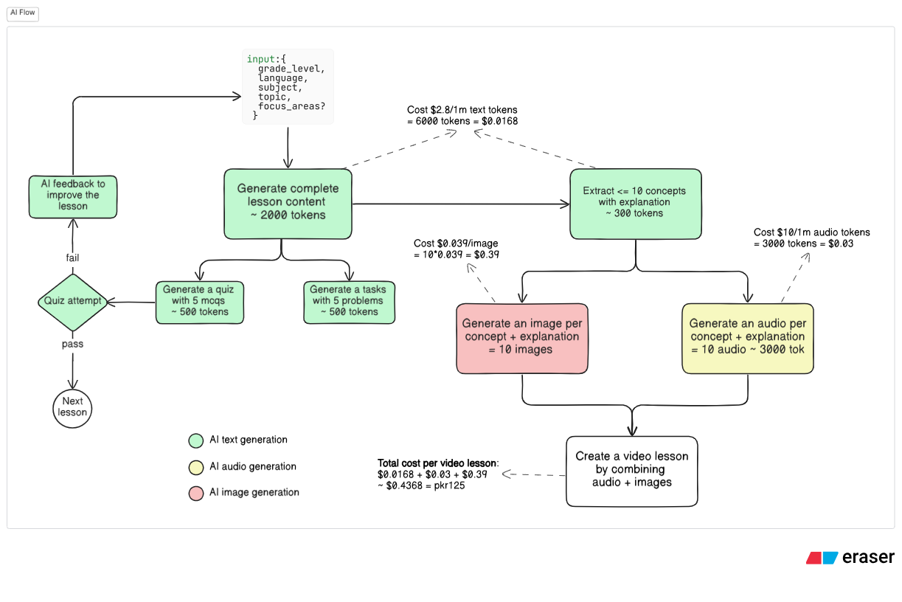
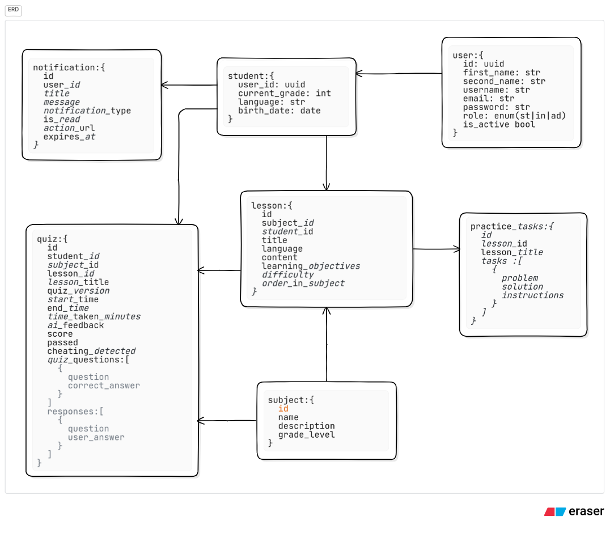

# Khan Education 🚀

**A modern, full-stack e-learning platform powered by AI-driven content generation and intelligent backend infrastructure.**

## ✨ Vision

To democratize and revolutionize education by leveraging artificial intelligence to create personalized, engaging, and high-quality learning experiences that adapt to every user's unique needs.

---

## 🎯 Key Features

### For Students

- **🤖 AI-Powered Assistance:** Integrated AI Tutor for interactive quizzes and a helpful AI Assistant for guided learning
- **📚 Rich Content Delivery:** Engaging lessons with Markdown support for formatted text, images, and code blocks
- **🧠 Interactive Quizzing:** Dynamic quizzes powered by AI to test knowledge and provide instant feedback
- **📊 Personalized Dashboards:** User-specific dashboards to view enrolled subjects and track learning progress
- **📈 Progress Analytics:** Visualize learning progress and quiz performance with insightful charts
- **🔍 Smart Search:** Quickly find subjects and lessons across the platform
- **📱 Responsive Design:** Seamless experience on desktops, tablets, and mobile devices

### For Educators & Admins

- **⚙️ Comprehensive Admin Panel:** Full suite of tools for managing users, subjects, and lessons
- **🤖 AI-Generated Content:** Dynamically creates comprehensive lessons and quizzes on any subject
- **🎥 Automated Video Lessons:** Generates complete video lessons with scripts and voiceovers for multi-modal learning
- **👤 User Management:** Complete system for managing profiles, tracking enrollment, and monitoring progress

### Technical Excellence

- **scalable & Robust Backend:** Built with **FastAPI** for high performance and reliability
- **☁️ Automated Cloud Deployment:** Infrastructure managed with **Terraform** and **CI/CD pipeline** via GitHub Actions
- **🏗️ Modern Architecture:** Clean, layered design for maintainability and extensibility

---

## 🎨 System Design

The system is designed for scalability, maintainability, and high performance, following modern software architecture principles.

### System Architecture

_Illustrates the decoupled, service-oriented architecture._


### AI Content Generation Flow

_Details the pipeline from prompt to generated text and video content._


### Entity-Relationship Diagram (ERD)

_Defines the database schema and relationships between data entities._


### Platform Screenshots

|                               Main Dashboard                               |                            Subject View                            |
| :------------------------------------------------------------------------: | :----------------------------------------------------------------: |
|                                     |                            |
| **A personalized dashboard for students to track their learning journey.** |         **Detailed subject pages with organized lessons.**         |
|                             **Lesson & Quiz**                              |                        **Interactive Quiz**                        |
|                                    |                           |
|          **Engaging lessons with tasks and integrated quizzes.**           | **AI-powered quizzes to test understanding and provide feedback.** |

---

## 💻 Tech Stack

This project is built with a modern and robust technology stack:

| Category             | Technology                                       |
| -------------------- | ------------------------------------------------ |
| **Frontend**         | TypeScript, React, Vite, Tailwind CSS, Shadcn/UI |
| **Backend**          | Python, FastAPI, Pydantic, Pynamodb              |
| **Database**         | DynamoDB                                         |
| **AI**               | Generative AI Models (Text & Video)              |
| **State Management** | Zustand, TanStack Query                          |
| **DevOps**           | Docker, Terraform, GitHub Actions                |
| **Tooling**          | `uv` (Python), npm (JavaScript)                  |

### Frontend Libraries & Tools

- **Routing:** React Router
- **Forms:** React Hook Form, Zod
- **Animation:** Framer Motion
- **Charts:** Recharts
- **UI Components:** Shadcn/UI

### Architecture Overview

The backend follows a clean, layered architecture:

- **Routers** (`/app/routers`): Defines API endpoints, handles request validation
- **Services** (`/app/services`): Core business logic and orchestration
- **CRUD** (`/app/crud`): Database abstraction layer for all data operations
- **Models & Schemas** (`/app/models.py`, `/app/schemas.py`): Database schemas (Pynamodb) and API contracts (Pydantic)
- **AI Engine** (`/app/ai`): Dedicated module for AI tasks, prompt engineering, and content generation

---

## 🚀 Getting Started

### Prerequisites

**For Both:**

- [Git](https://git-scm.com/)
- [AWS CLI](https://aws.amazon.com/cli/) configured with your credentials (for deployment)
- [Terraform](https://developer.hashicorp.com/terraform/downloads) (for deployment)

**For Backend:**

- Python 3.11+
- [Docker](https://www.docker.com/)
- `uv` (recommended for Python package management)

**For Frontend:**

- [Node.js](https://nodejs.org/en) (v18 or later)
- [npm](https://www.npmjs.com/) or [yarn](https://yarnpkg.com/)

### Backend Setup

1. **Clone the backend repository:**

   ```bash
   git clone https://github.com/ikram98ai/khaneducation.git
   cd khaneducation
   ```

2. **Set up environment variables:**

   ```bash
   cp .env.example .env
   ```

   Fill in required values (database credentials, API keys, etc.)

3. **Install dependencies:**

   ```bash
   uv pip install -r requirements.txt
   ```

4. **Run the application:**

   ```bash
   uvicorn app.main:app --reload
   ```

   API documentation available at `http://127.0.0.1:8000/docs`

5. **Seed the database (optional):**
   ```bash
   python seed_db.py
   ```

### Frontend Setup

1. **Clone the frontend repository:**

   ```bash
   cd web
   ```

2. **Install dependencies:**

   ```bash
   npm install
   ```


3. **Run the development server:**
   ```bash
   npm run dev
   ```
   Access at `http://localhost:5173`

---

## 📜 Available Scripts

### Backend

- `uvicorn app.main:app --reload`: Runs the development server
- `python seed_db.py`: Populates database with initial test data

### Frontend

- `npm run dev`: Starts Vite development server
- `npm run build`: Builds for production
- `npm run lint`: Runs ESLint
- `npm run type-check`: TypeScript static type check
- `npm run deploy`: Full deployment pipeline (build, upload to S3, invalidate CloudFront)

---

## 📚 API Documentation

Interactive Swagger UI documentation is automatically generated and available at:
`http://127.0.0.1:8000/docs`

---

## ✨ Live Demo

**[Visit Khan Education](https://khaneducation.ai)**

---

## 🤝 Contributing

Contributions are welcome! If you have suggestions for improvements or want to fix a bug, please feel free to open an issue or submit a pull request.

---

## 📄 License

This project is licensed under the MIT License. See the `LICENSE` file for more details.
